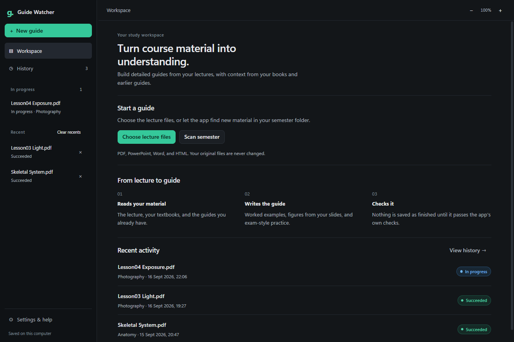
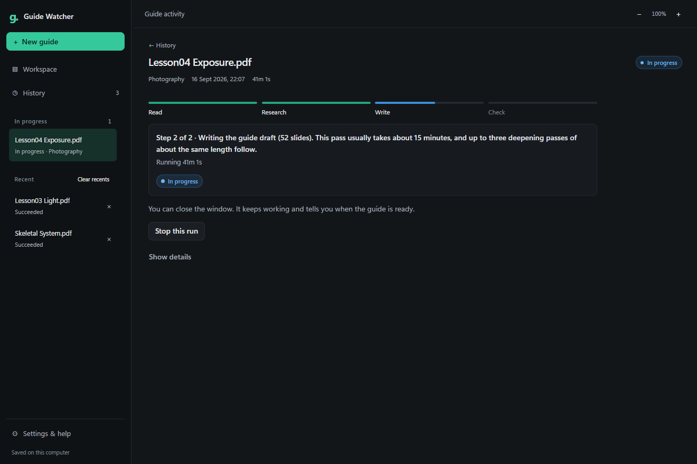
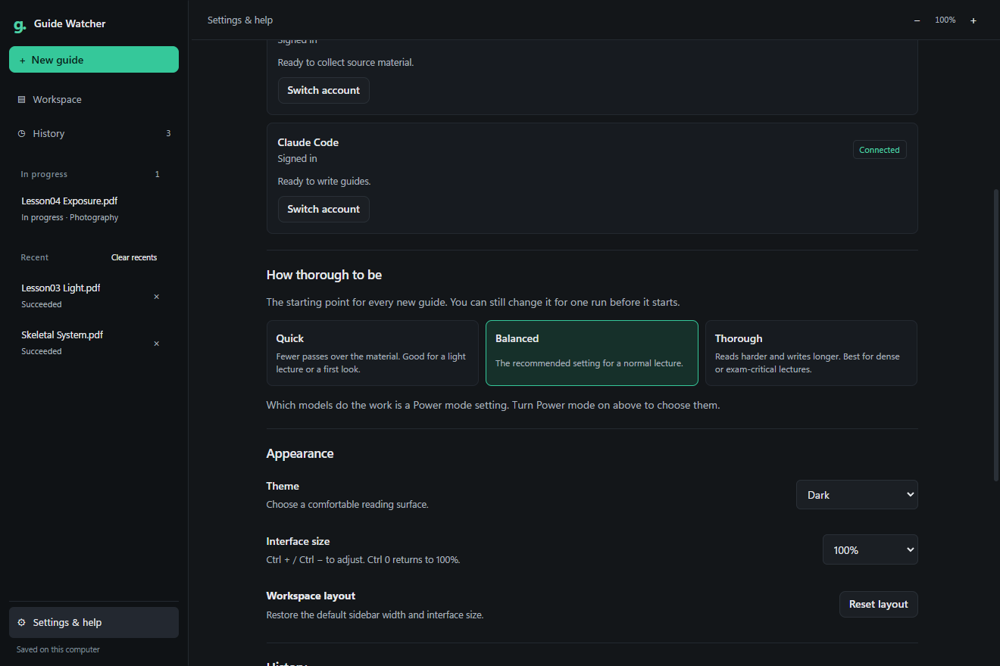
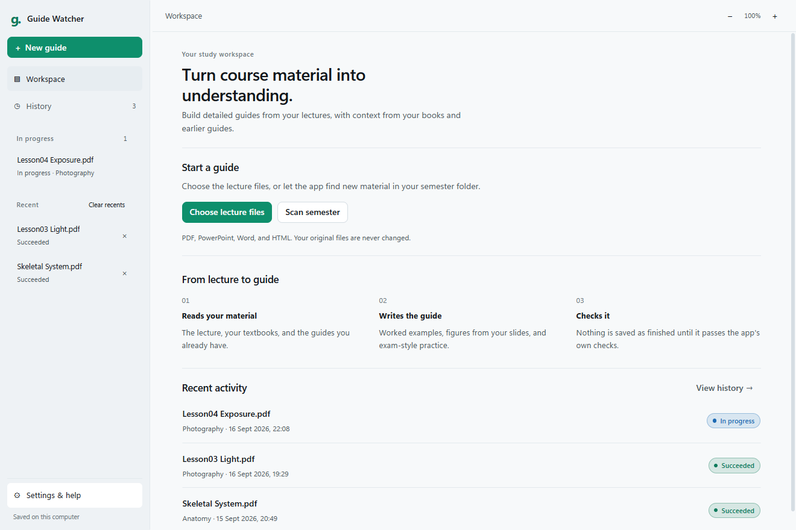

<div align="center">

# Guide Watcher

**Turn a folder of lectures into study guides worth reading.**

Point it at your course material. It reads your slides, your textbooks and the guides it has
already written, then writes a new guide with worked examples, your own figures and exam-style
practice, and refuses to call it finished until it passes its own checks.

[](https://github.com/mushfique-dgist/guide-watcher/releases/latest)
[](https://github.com/mushfique-dgist/guide-watcher/releases/latest)
[](https://github.com/mushfique-dgist/guide-watcher/releases)
[](LICENSE)



</div>

## What it does

A study guide it writes is not a summary. For a 115-slide lecture it produced 57,592 words with
139 worked examples, 35 figures taken from the slides themselves, and ten exam-style questions
modelled on a past paper you supply. It took 76 minutes and told you when it was done.

| Capability | What it means in practice |
| --- | --- |
| **Reads what you already have** | Your slides, the textbooks in the same folder, and every guide it wrote for earlier lectures, so each guide builds on the last instead of repeating it. |
| **Finds what you do not have** | With only a slide deck, the public web and public lecture video become the backbone of the guide: standards, official documentation, university course pages and recorded lectures, each cited with a section, page or timestamp, and never fewer than two independent publishers. |
| **Teaches, rather than narrating slides** | Rules it must follow: describe a thing before naming it, open each section with the problem it solves, give an analogy and say where the analogy breaks, and never write "any questions?" because a slide said it. |
| **Checks its own work** | Arithmetic that does not add up, sections with no worked example, terms used before they are defined, figures never mentioned in the prose. A guide is published only after it passes. |
| **Keeps going when a model gives out** | Two providers. If one hits a usage limit or is signed out, the run moves to the next rather than dying, and continues a half-finished draft in the same voice. |
| **Leaves your files alone** | It reads your material and writes new Markdown beside it. Nothing you own is modified. |

## Screenshots

**Four steps and a clock, while it works.** A guide takes one to three hours, so the run view
says which stage it is in, how long is left, and that you can close the window.



**One question instead of ten.** The screen before a run asks how thorough to be. Every model,
effort level and fallback still exists; they come back with one **Power mode** switch.



**Light and dark are both first-class.**



## Install

**[Download for your computer &rarr;](https://github.com/mushfique-dgist/guide-watcher/releases/latest)**

| Your computer | Take this file |
|---|---|
| Windows 10 or 11 | `Guide.Watcher_<version>_x64-setup.exe`, or the `.msi` if your machine is managed |
| macOS, Apple silicon | `Guide.Watcher_<version>_aarch64.dmg` |
| macOS, Intel | `Guide.Watcher_<version>_x64.dmg` |
| Debian or Ubuntu | `Guide.Watcher_<version>_amd64.deb` |
| Fedora or openSUSE | `Guide.Watcher-<version>-1.x86_64.rpm` |
| Any other Linux | `Guide.Watcher_<version>_amd64.AppImage` |

Every release carries `SHA256SUMS.txt` and a GitHub build-provenance attestation, which is
cryptographic proof of the exact commit and workflow that produced each file. To check one:

```bash
gh attestation verify Guide.Watcher_2.1.0_x64-setup.exe --repo mushfique-dgist/guide-watcher
sha256sum -c SHA256SUMS.txt        # certutil -hashfile <file> SHA256 on Windows
```

Every release is also scanned by all 70 engines on VirusTotal before it is published, and the
results are linked from the release notes: the macOS disk image is clean, and the Windows
installer is flagged only by SecureAge, a machine-learning engine that flags installers it has
not seen signed. Microsoft Defender, Kaspersky, ESET, BitDefender and CrowdStrike report it clean.

<details>
<summary>If your browser or operating system warns about the download</summary>

Windows SmartScreen and macOS Gatekeeper judge an application by how many people have already
run it, so a new one is unknown to them until it has been downloaded many times.

- **Windows:** choose *More info* &rarr; *Run anyway*.
- **macOS:** open the `.dmg`, then right-click the app and choose *Open*, once.
- **Linux:** the AppImage needs `chmod +x` before it will run.

Check the checksum and the attestation above if you would rather not take that on trust.

</details>

### Build it yourself

```bash
npm install
npx tauri build
```

## Before your first guide

Guide Watcher does not ship a model and never asks for an API key. It drives two command-line
tools you install and sign in to yourself, so your subscription and your credentials stay yours.

1. **Install and sign in to both CLIs.** [Claude Code](https://claude.com/claude-code) writes the
   guides; [OpenAI Codex](https://developers.openai.com/codex/cli) collects the material.
2. **Install Python 3.13** and the checker's packages:
   `pip install pymupdf markdown-it-py requests`.
3. **Open the app.** It asks the rest itself.

The first run is a wizard with two doors:

- **Walk me through it** — three questions: where your course material lives, where the
  `_automation` folder is, and which subjects you want guides for. Every answer is checked
  against your computer before it is saved, so nothing fails later with a path error.
- **Let my AI assistant do it** — if Claude Code is signed in on this machine, the app writes it
  a brief, opens a terminal with it running, and waits. The assistant asks you where your
  material lives, checks the prerequisites, writes the settings file, and the app carries on by
  itself the moment it appears.

Settings live in one JSON file in your own configuration directory — `%APPDATA%`,
`~/Library/Application Support`, or `$XDG_CONFIG_HOME` — which you can read and edit by hand.
The same wizard is in **Settings &rarr; This computer** whenever you want to change an answer.

Already running an older build? Point your assistant at
[`UPDATE_FOR_AI.md`](UPDATE_FOR_AI.md), which carries your settings forward and asks you for
whatever it cannot work out on its own.

## How a guide is made

Two phases, two different models, neither trusted on its own.

1. **Collect.** Extract the text and page images, rank which figures are worth teaching from, pull
   the relevant pages out of any book in the folder, research the topic in public sources, and
   freeze all of it into an evidence packet with checksums. Nothing later may read a file that is
   not in that packet. How much of that evidence has to come from outside depends on what you
   supplied: with a book beside the deck, research supports it; with only the deck, public
   sources are the backbone and two independent ones are the minimum.
2. **Write.** Draft against that packet, deepen it in bounded passes, then fix exactly what the
   checker reports. A model finishing its response proves nothing; only the checks do.

If a run dies halfway, the next attempt picks up the draft it left rather than starting over, and
follows a style plan the first writer recorded so the seams do not show.

## Command line

The same pipeline runs headless, which is also how it is tested:

```bash
guide-watcher-cli check <lecture.pdf | guide.prep.md>   # full preflight, starts no model
guide-watcher-cli generate <lecture.pdf>
guide-watcher-cli resume <guide.prep.md>
guide-watcher-cli supplementary plan|collect|status <course folder>
```

`check` is the honest gate: everything a real run does up to the moment a model would start.

## Repository

| Path | What it holds |
|---|---|
| `src/` | The Svelte interface |
| `src-tauri/src/` | The Rust pipeline: source capture, figure selection, both provider phases, publication |
| `scripts/` | Install helpers, and settings migration between versions |
| `_automation/` | Ships alongside: the writing rules, the depth contract, the checker |

## Licence

MIT. See [LICENSE](LICENSE).
